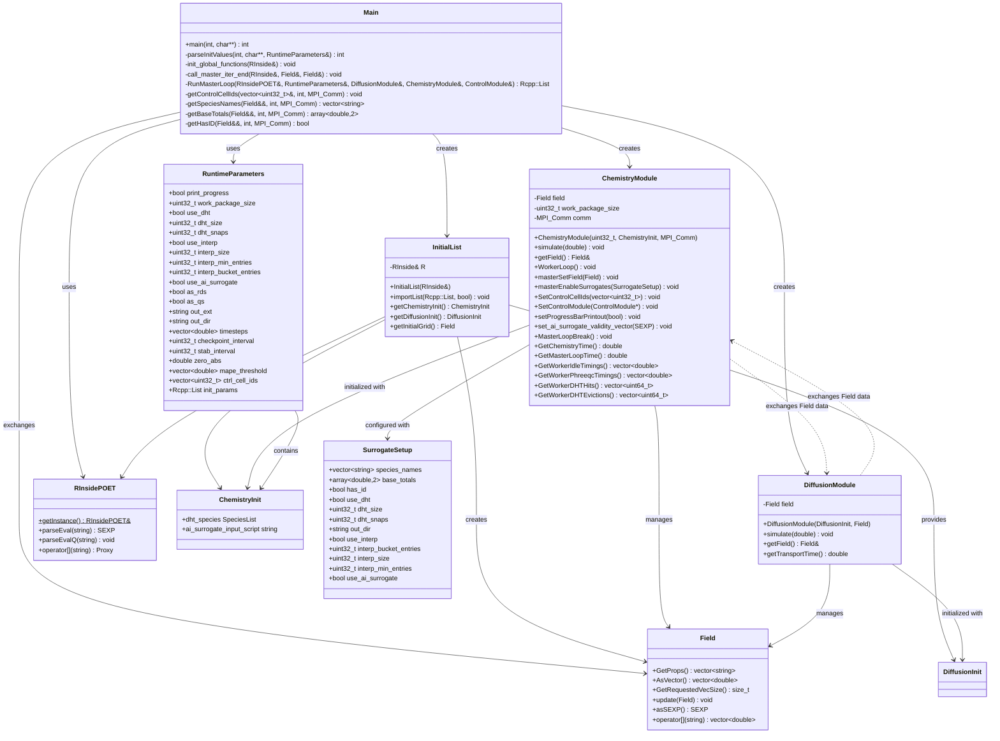

# POET Class Diagram

## Key Relationships

- **Main** orchestrates the entire simulation, coordinating between modules
- **InitialList** parses R configuration and initializes all modules
- **ChemistryModule** and **DiffusionModule** exchange data via **Field** objects
- **Field** is the core data structure representing the simulation grid
- **RInsidePOET** provides the R runtime interface (singleton pattern)
- **RuntimeParameters** holds all command-line and configuration parameters
- **SurrogateSetup** configures advanced features (DHT, interpolation, AI surrogate)

## Module Communication Flow

1. Main reads configuration via `parseInitValues()`
2. `InitialList` imports R scripts and creates initial `Field`
3. `ChemistryModule` and `DiffusionModule` are initialized with their respective configurations
4. In simulation loop:
   - `DiffusionModule.simulate()` updates transport field
   - `ChemistryModule` receives updated field via `update()`
   - `ChemistryModule.simulate()` computes chemistry
   - `DiffusionModule` receives updated field back
5. MPI communication handled internally by modules
